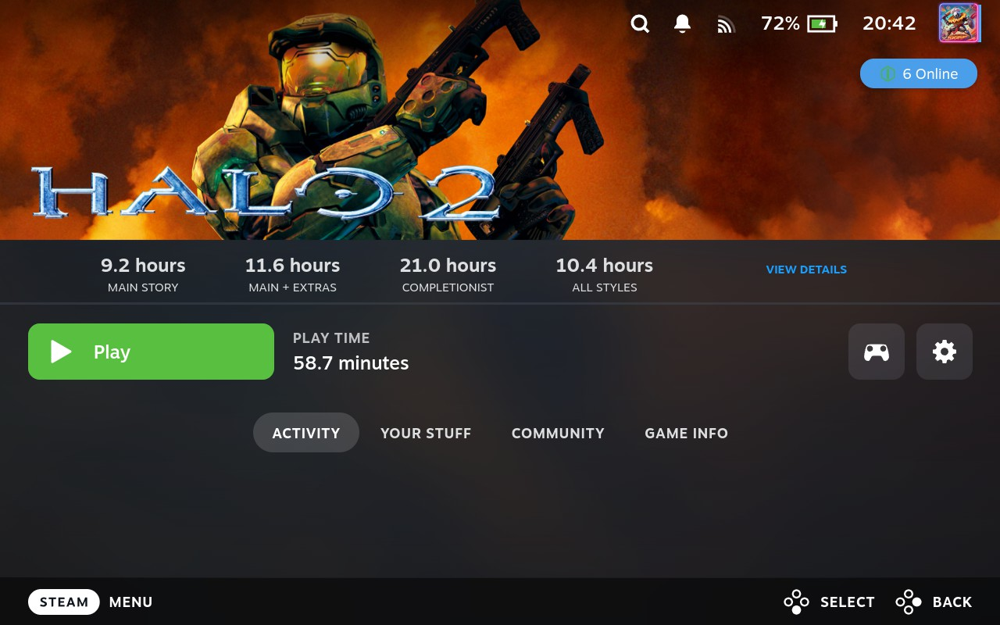
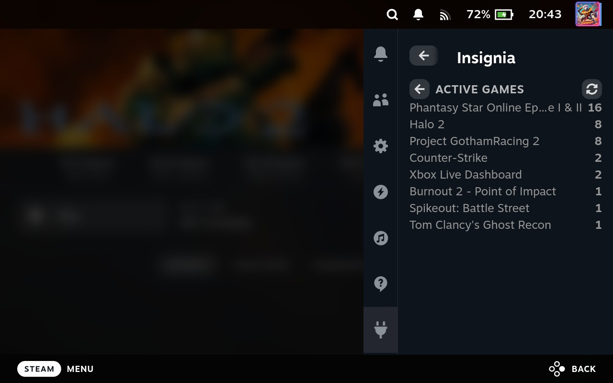
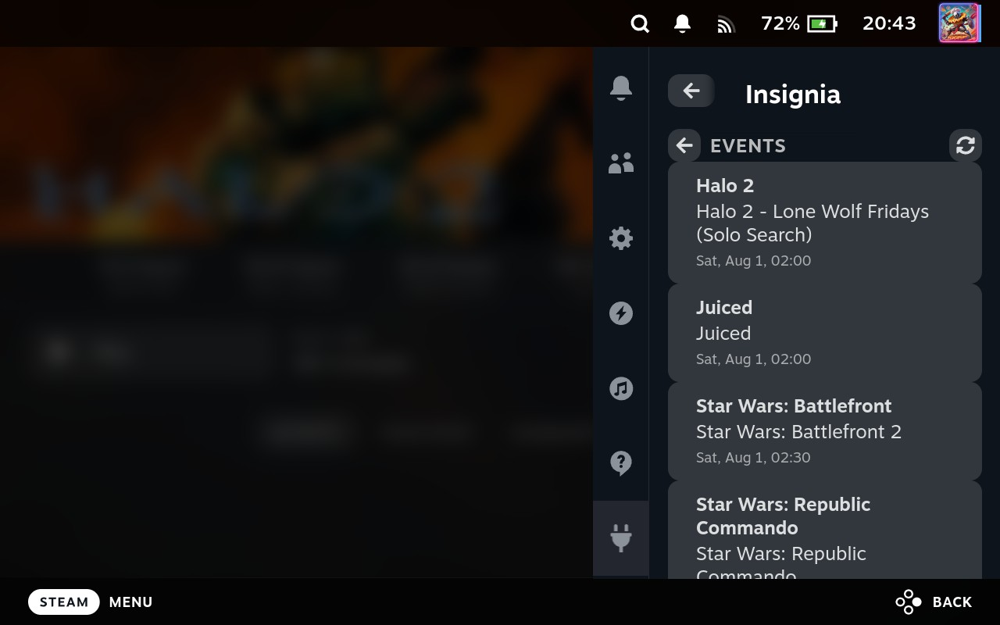
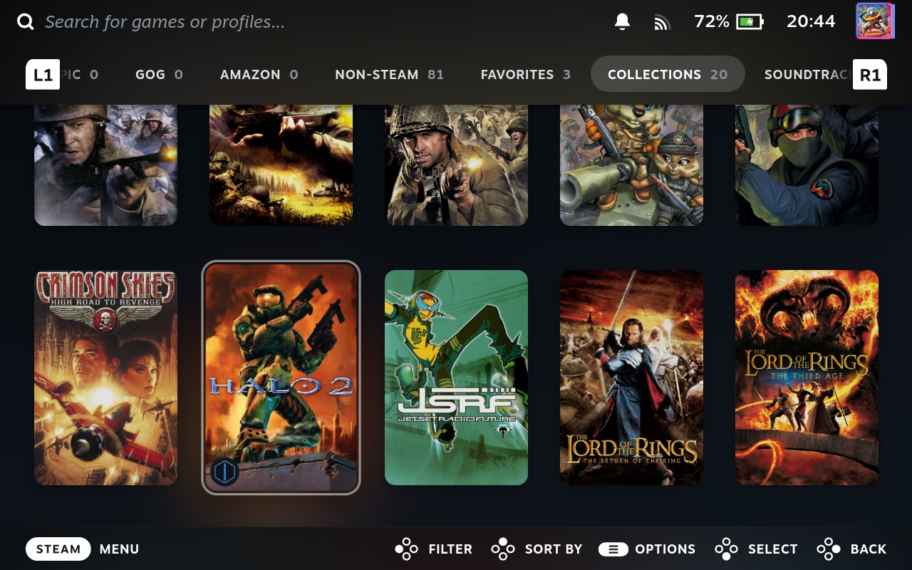
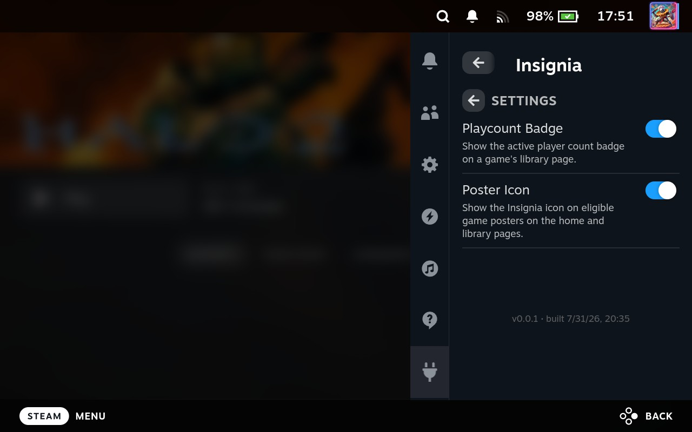

# Decky Insignia

A [Decky Loader](https://github.com/SteamDeckHomebrew/decky-loader) plugin for the Steam Deck's Quick Access Menu that surfaces live stats from the [Insignia network](https://insigniastats.live) — an Xbox-emulation multiplayer/matchmaking service — and overlays playcount/poster badges on Xbox-ROM game tiles elsewhere in Steam's UI.

## Features

- **Library page badge** — a playcount badge on a supported game's library page, showing its current online player count.

  

- **Active Games** — currently active Insignia games with live player/lobby counts, in the Quick Access Menu sidebar.

  

- **Events** — upcoming Insignia community events within the next two weeks.

  

- **Home page tile badge** — an Insignia icon overlaid on supported Xbox-ROM game tiles across Steam's UI (home page, collections, etc.), so supported titles are identifiable at a glance.

  

- **Settings** — toggle the playcount badge and poster icon independently.

  

## Installation

Insignia isn't in the Decky Store yet, so install it from a plugin zip via Decky's developer options:

1. On the Deck, switch to Desktop Mode.
2. Download a zip — either grab one from the [Releases page](https://github.com/snoein/decky-insignia/releases), or build it yourself (see [Developers](#developers) below); a local `builddeploy`/`build` run produces `out/Insignia.zip`.
3. Switch back to Gaming Mode.
4. Open the Quick Access Menu, click the Decky gear icon to open its settings, go to the **General** tab, and enable **Developer Mode** — this adds a **Developer** section to Decky's settings.
5. In that Developer section, click **Install Plugin from Zip** and select the zip from step 2.

Insignia should now appear in the Quick Access Menu plugin list.

## How it works

A Decky plugin has two independently-built halves that communicate over a Python↔JS bridge (`@decky/api`'s `callable()`):

- **Frontend** (`src/`) — a React component tree built by rollup into `dist/index.js`, which decky-loader loads directly. The Quick Access Menu sidebar has no built-in router, so navigation between panels (`MenuPage`, `ActiveGamesPage`, `EventsPage`, `SettingsPage`) is local `useState`. Route patches (`src/patches/`) inject the library-page badge and scan/badge home-page tiles via a `MutationObserver`.
- **Backend** (`main.py` + `defaults/python_backend/`) — `main.py`'s `Plugin` class is decky-loader's entry point; its async methods delegate to `python_backend/{stats,events,xbox_shortcuts,settings}.py`. It fetches and caches Insignia API responses, and reads `shortcuts.vdf` directly to identify non-Steam shortcuts pointing at Xbox ROMs.

See [CLAUDE.md](CLAUDE.md) for a detailed architecture writeup, including why the backend code lives under `defaults/python_backend/` rather than a plain `backend/` or `py_modules/`-style directory.

## Developers

### Quickstart

Get the plugin building locally and running on your Steam Deck.

1. **Install prerequisites** — Node.js v16.14+, `pnpm` v9, and Docker (used by the Decky CLI to build the final plugin zip; the CLI runs in a container since the host glibc is too old for the binary directly):

   ```bash
   sudo npm i -g pnpm@9
   ```

2. **Clone and install frontend deps**:

   ```bash
   git clone https://github.com/snoein/decky-insignia.git
   cd decky-insignia
   pnpm i
   ```

3. **Configure your Deck's connection info.** `.vscode/settings.json` is gitignored and user-specific, so it won't exist yet on a fresh clone. Either create it yourself from the template:

   ```bash
   cp .vscode/defsettings.json .vscode/settings.json
   ```

   or just run the `build`/`builddeploy` task once — `.vscode/config.sh` auto-creates it from `defsettings.json` and exits, prompting you to edit it before re-running. Either way, set at least `deckip`, `deckpass`, and `pluginname` (`"Insignia"`) to match your Deck (Decky enables SSH by default with user `deck`).

4. **Build and deploy** — in VSCode/VSCodium, run the **`builddeploy`** task (`Terminal → Run Task…`). This installs deps, builds the plugin via the Decky CLI in Docker, rsyncs the zip to your Deck over SSH, and extracts it into `homebrew/plugins`. First run will take a while (Docker image pull + CLI build); later runs are faster.

   Not using VSCode? Run the equivalent commands by hand — see `.vscode/build.sh` and the `copyzip`/`extractzip`/`chmodplugins` commands in `.vscode/tasks.json`.

5. **Restart the plugin loader** so the Deck picks up the new plugin — run the **`restartdecky`** task, or from your machine:

   ```bash
   ssh -i ~/.ssh/id_rsa deck@<deckip> "echo <deckpass> | sudo -S systemctl restart plugin_loader"
   ```

   Insignia should now appear in the Quick Access Menu plugin list on the Deck.

From here, for frontend-only changes, skip the slow Docker rebuild and use the [fast iteration loop](#fast-iteration-loop-frontend-only-changes) below instead.

### Building without Docker (frontend only)

The Quickstart's `builddeploy` task rebuilds the whole plugin, backend included, via the Docker-based Decky CLI. If you're only touching `src/`, `pnpm run build`/`pnpm run watch` (plain rollup, no Docker) is enough to produce an up-to-date `dist/index.js` — see the [fast iteration loop](#fast-iteration-loop-frontend-only-changes) below to get it onto the Deck without a full `builddeploy`.

There is no lint script and no real test suite (`pnpm test` is a stub).

### Regenerating vendored Python dependencies

The Python backend's third-party dependencies are vendored rather than installed at runtime — regenerate `py_modules/` (gitignored) from `requirements.txt` whenever it changes:

```bash
pip install --target=py_modules -r requirements.txt
```

### VSCode tasks reference (`.vscode/tasks.json`)

Full list of tasks used above, plus a couple that aren't part of the Quickstart flow:

- `setup` — installs deps, runs `pnpm i`, updates `@decky/ui`.
- `build` — full plugin build via `.vscode/build.sh`, running the `decky` CLI inside a throwaway `ubuntu:24.04` Docker container. Output goes to `out/`.
- `deploy` — rsyncs the built zip in `out/` to a Steam Deck over SSH and extracts it into `homebrew/plugins`.
- `builddeploy` — `build` then `deploy`.
- `restartdecky` — restarts `plugin_loader` on the target Deck over SSH.

### Fast iteration loop (frontend-only changes)

Rebuilding the whole plugin zip via Docker is slow for a quick frontend tweak. Once the plugin has been deployed at least once via `builddeploy`, iterate faster by pushing just the built bundle over the same SSH connection and restarting the loader:

```bash
pnpm run build
scp -i ~/.ssh/id_rsa dist/index.js dist/index.js.map <deckuser>@<deckip>:<deckdir>/homebrew/plugins/Insignia/dist/
ssh -t -i ~/.ssh/id_rsa <deckuser>@<deckip> "echo <deckpass> | sudo -S systemctl restart plugin_loader"
```

(Values for `<deckuser>`/`<deckip>`/`<deckdir>`/`<deckpass>` come from `.vscode/settings.json`.) This skips repackaging `main.py`/`plugin.json`/`py_modules/`, so use the real `builddeploy` task whenever those change.

### Debugging on-device

- **Backend logs**: `journalctl -u plugin_loader` on the Deck shows plugin load/unload lifecycle events and any Python exceptions. Per-plugin log files also live at `~/homebrew/logs/Insignia/` on the Deck.
- **Frontend runtime state/errors**: not logged anywhere — inspect the browser context decky-loader injects into. Steam's `steamwebhelper` exposes a Chrome DevTools Protocol endpoint at `127.0.0.1:8080` on the Deck; tunnel it over SSH, then use the `SharedJSContext` CDP target (where every decky plugin's frontend actually executes) to run arbitrary JS live. See [CLAUDE.md](CLAUDE.md) for the full walkthrough.

## Store submission assets

See [docs/generate-publish-image.md](docs/generate-publish-image.md) for how the store's `publish-image.png` composite is generated from the screenshots in `images/`.

## License

BSD 3-Clause — see [LICENSE](LICENSE). This repository was bootstrapped from the [decky-plugin-template](https://github.com/SteamDeckHomebrew/decky-plugin-template), whose original license is preserved alongside this project's.
